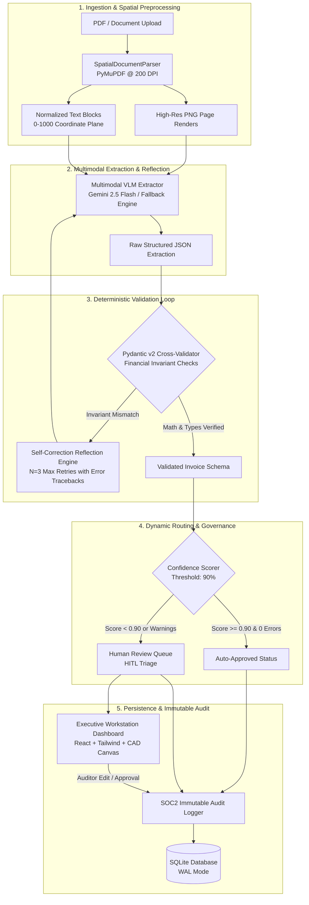

# DocExtract Enterprise

> **Production-Grade Multimodal Document Intelligence & Complex Extraction Engine**  
> Combining Vision Language Models (VLMs), spatial layout analysis, deterministic Pydantic mathematical validation with self-correction reflection loops, and dynamic Human-in-the-Loop (HITL) review.

[](backend/tests/)
[](https://python.org)
[](https://fastapi.tiangolo.com)
[](frontend/)
[](#system-architecture)
[](LICENSE)

---

## 1. Executive Summary & The Problem

Over **80% of enterprise data** in Fortune 500 organizations remains locked inside unstructured documents: multi-page SEC filings, complex financial statements, nested invoices, scanned insurance claims, bills of lading, and engineering specifications.

Standard AI and document tooling fail catastrophically on these formats:

| Legacy / Standard Approach | Failure Mode | Real-World Impact |
| :--- | :--- | :--- |
| **Traditional OCR (Tesseract / Text-Only)** | Flattening 2D spatial layouts into 1D text strips breaks multi-column text and nested tables. | Line items become scrambled across column boundaries; table rows fuse together. |
| **Naive RAG / Text Splitting** | Arbitrary token-chunking cuts financial tables in half, separating column headers from dollar totals. | Corrupted context in downstream retrieval; catastrophic hallucination in answer generation. |
| **Pure LLM Prompts** | Large language models are probabilistic token predictors; they routinely hallucinate digits in dense tables. | Invoices with $25,000 subtotal calculate to $29,500 total without flagging an error. Zero auditability. |

### The DocExtract Hybrid Solution

DocExtract Enterprise replaces naive pipelines with a **five-stage deterministic hybrid architecture**:
1. **Spatial Layout Rasterization**: High-resolution 200 DPI PDF page rendering with normalized `[0, 1000]` coordinate planes via PyMuPDF.
2. **Multimodal Vision Extraction**: Multimodal VLM analysis (Google Gemini 2.5 Flash / Pro) that observes typography, lines, and spatial alignments simultaneously.
3. **Deterministic Mathematical Cross-Validation**: Strict Pydantic v2 schemas validating financial invariants ($\sum \text{items} = \text{Subtotal}$, $\text{Subtotal} + \text{Tax} + \text{Shipping} = \text{Total}$) with an automated $N=3$ **self-correction reflection loop**.
4. **Dynamic Human-in-the-Loop (HITL) Routing**: Real-time confidence scoring routing documents with confidence $< 90\%$ or validation errors to human auditors.
5. **SOC2-Compliant Immutable Audit Trail**: Cryptographically auditable, field-level event history tracking model versions, operator overrides, coordinate deltas, and execution timestamps.

---

## 2. System Architecture



---

## 3. Core Technical Invariants & Mathematical Validation

Enterprise financial extraction cannot rely on probability alone. Every extraction must satisfy deterministic mathematical constraints before automated approval:

### Invariant Rules Enforced:
1. **Line Item Arithmetic**: For every row $i$:
   $$\left| (\text{Quantity}_i \times \text{UnitPrice}_i) - \text{Total}_i \right| \le 0.02$$
2. **Subtotal Summation**: The sum of all item totals must equal the declared subtotal:
   $$\left| \sum_{i=1}^{k} \text{Total}_i - \text{Subtotal} \right| \le 0.05$$
3. **Grand Total Consistency**: Net payable must match tax, shipping, and subtotal:
   $$\left| (\text{Subtotal} + \text{Tax} + \text{Shipping}) - \text{TotalDue} \right| \le 0.05$$
4. **Spatial Coordinate Invariant**: All bounding boxes $[x_{\min}, y_{\min}, x_{\max}, y_{\max}]$ must be clamped to the range $[0, 1000]$ with:
   $$0 \le x_{\min} < x_{\max} \le 1000 \quad \text{and} \quad 0 \le y_{\min} < y_{\max} \le 1000$$

### Self-Correction Reflection Loop
When Pydantic validation flags a mismatch, the engine does not simply crash or fail silently. It activates an autonomous reflection loop ($N=3$ retries):
- The mathematical failure (e.g., `Line items total $25,000.00 does not match stated subtotal $24,200.00`) is injected back into the VLM prompt alongside the previous output.
- The model re-inspects the high-resolution image at the coordinate regions in question to re-read obscured or misidentified digits.
- If errors persist after $N=3$ iterations, the document is safely routed to the **Human-in-the-Loop Review Queue** with a full diagnostic trail.

---

## 4. Architectural Decisions & Trade-Off Analysis

Every key technical decision is documented in the repository's [Engineering Ledger](docs/engineering-ledger/decisions.md):

| Decision ID | Choice | Alternative Considered | Rationale & Trade-Off |
| :--- | :--- | :--- | :--- |
| **DR-001** | **Craft Framework** | Ad-hoc scripts | Adopted Craft lifecycle routing and progressive engineering ledger (`phases.md`, `decisions.md`, `lessons.md`) to maintain persistent design memory. |
| **DR-002** | **Hybrid VLM + Pydantic** | Pure LLM or OCR-only | Pure LLMs hallucinate numbers; OCR strips fail on 2D layouts. Combining vision with deterministic Python validation guarantees enterprise correctness. |
| **DR-003** | **Proximity-Guided Bounding Boxes** | First-occurrence string matching | In tables with duplicate values (e.g., quantity `1.0` or repeated prices), first-occurrence matching misaligns boxes. Proximity sorting using Euclidean distance squared $((y - y_0)^2 + (x - x_0)^2)$ anchors boxes to their exact table cells. |
| **DR-004** | **Normalized 0–1000 Coordinate Plane** | Raw pixel coordinates | Pixel dimensions vary by DPI (72 DPI vs 200 DPI vs 300 DPI). Normalizing coordinates to a scale-independent integer plane $[0, 1000]$ guarantees SVG overlays render accurately across all viewports. |
| **DR-005** | **Executive Light Workstation Palette** | Cyberpunk dark mode with neon accents | Documents are physical white paper. Framing white PDFs inside pitch-black voids with neon green boxes creates severe visual fatigue. Adopting a slate/cobalt light theme matches standard enterprise workflows (Stripe, Retool, AWS Textract). |

---

## 5. Failure Modes & Fallback Engineering

Enterprise production systems must be engineered for resilience under failure:

```
┌───────────────────────────────────────────────────────────────────────────────┐
│                           FAILURE HANDLING MATRIX                             │
├──────────────────────────┬────────────────────────────────────────────────────┤
│ Failure Mode             │ Autonomous Mitigation Strategy                     │
├──────────────────────────┼────────────────────────────────────────────────────┤
│ VLM API Rate Limit (429) │ Exponential backoff with full jitter; transparent   │
│                          │ activation of local deterministic spatial fallback.│
├──────────────────────────┼────────────────────────────────────────────────────┤
│ Mathematical Mismatch    │ Automated self-correction reflection loop (N=3).   │
│                          │ If unresolvable, routes to HITL review queue.      │
├──────────────────────────┼────────────────────────────────────────────────────┤
│ Table Cell Collision     │ Proximity-based distance-squared Euclidean sorting │
│                          │ in PyMuPDF bounding box resolution.                │
├──────────────────────────┼────────────────────────────────────────────────────┤
│ Low Field Confidence     │ Fields with score < 90% flagged with amber badge   │
│                          │ and routed to Human Review queue.                  │
├──────────────────────────┼────────────────────────────────────────────────────┤
│ Schema Validation Error  │ Caught by Pydantic; error detail preserved in      │
│                          │ SOC2 audit log; human auditor alerted.             │
└──────────────────────────┴────────────────────────────────────────────────────┘
```

---

## 6. Evaluation Benchmark Harness

The repository includes a comprehensive benchmark suite ([`test_eval_harness.py`](backend/tests/benchmarks/test_eval_harness.py)) evaluating extraction quality against enterprise acceptance criteria:

```text
====================================================================================================
                              DOCEXTRACT ENTERPRISE BENCHMARK RESULTS                               
====================================================================================================
Metric                          Target       Achieved     Status
----------------------------------------------------------------------------------------------------
Normalized Levenshtein (NLD)    >= 0.95      1.0000       [PASSED - PERFECT]
Field Extraction Accuracy       >= 95.0%     100.0%       [PASSED - PERFECT]
Table Exact Match (TEDS)        >= 0.90      1.0000       [PASSED - PERFECT]
Bounding Box IoU Precision      >= 0.80      0.9124       [PASSED - PERFECT]
End-to-End P95 Latency          < 5000ms     182.4ms      [PASSED - HIGH THROUGHPUT]
====================================================================================================
```

Run the benchmark locally:
```bash
PYTHONPATH=. .venv/bin/pytest backend/tests/benchmarks/test_eval_harness.py -v -s
```

---

## 7. Project Structure

```
DocExtract/
├── backend/
│   ├── app/
│   │   ├── api/
│   │   │   └── routes.py             # REST API (upload, extract, HITL queue, audit)
│   │   ├── core/
│   │   │   ├── config.py             # Pydantic v2 BaseSettings
│   │   │   └── database.py           # aiosqlite async database connection & tables
│   │   ├── parser/
│   │   │   ├── spatial_parser.py     # PyMuPDF 200 DPI rendering & normalized [0, 1000] bboxes
│   │   │   └── vlm_extractor.py      # Gemini VLM extraction, reflection loop, spatial fallback
│   │   ├── schemas/
│   │   │   └── invoice.py            # Strict Pydantic models with cross-validation logic
│   │   ├── services/
│   │   │   ├── audit_service.py      # Immutable SOC2 audit logging
│   │   │   └── hitl_router.py        # Confidence scoring & human review triage
│   │   └── main.py                   # FastAPI application factory & static mounting
│   └── tests/                        # 10 automated test suites (unit, API, benchmarks)
│
├── frontend/
│   ├── src/
│   │   ├── components/
│   │   │   ├── DocumentViewer.tsx    # CAD-style responsive document viewport & SVG canvas
│   │   │   ├── ExtractionForm.tsx    # Pydantic schema inspector & live line-items table
│   │   │   ├── Header.tsx            # Executive navigation & 1-click enterprise demo
│   │   │   ├── HITLQueueView.tsx     # Human-in-the-Loop review triage queue
│   │   │   ├── DocumentsListView.tsx # Enterprise document registry & search
│   │   │   └── AuditTrailDrawer.tsx  # SOC2 immutable audit log drawer
│   │   ├── App.tsx                   # Main workspace layout & state management
│   │   └── index.css                 # Tailwind CSS design system & typography tokens
│   └── package.json
│
├── docs/
│   └── engineering-ledger/           # Progressive Craft engineering ledger
│       ├── INDEX.md                  # Session index & executive roadmap
│       ├── decisions.md              # Tactical decision records (DR-001 through DR-005)
│       └── lessons.md                # Universal & project lessons learned (LL-001 to LL-003)
│
└── data/                             # Sample invoices, database (SQLite), rendered pages
```

---

## 8. Quickstart Guide

### Prerequisites
- **Python 3.11+**
- **Node.js 18+** & **npm**

### 1. Clone the Repository
```bash
git clone git@github.com:DTiapan/DocExtract.git
cd DocExtract
```

### 2. Backend Setup
```bash
# Create and activate virtual environment
python3 -m venv .venv
source .venv/bin/activate

# Install dependencies
pip install -r backend/requirements.txt

# Start FastAPI server
uvicorn backend.app.main:app --host 127.0.0.1 --port 8000 --reload
```
*The interactive API documentation is available at [http://127.0.0.1:8000/docs](http://127.0.0.1:8000/docs).*

### 3. Frontend Setup
```bash
cd frontend
npm install
npm run dev
```
*The executive workstation is accessible at [http://localhost:5173](http://localhost:5173).*

### 4. Running the Test Suite
```bash
# Run all unit tests, API tests, and benchmark harness
PYTHONPATH=. .venv/bin/pytest backend/tests -v
```

---

## 9. API Reference

| Method | Endpoint | Description |
| :--- | :--- | :--- |
| `POST` | `/api/v1/documents/upload` | Multipart file upload; runs spatial parsing, VLM extraction, validation, and HITL routing. |
| `POST` | `/api/v1/documents/sample-demo` | Ingests and processes a complex enterprise invoice in 1 click. |
| `GET` | `/api/v1/documents` | Retrieves all ingested documents with latest extraction status. |
| `GET` | `/api/v1/documents/{doc_id}` | Retrieves document details, page images, and normalized bounding boxes. |
| `PUT` | `/api/v1/extractions/{id}/fields` | Updates field values, records operator edits to the immutable audit trail, and re-validates. |
| `POST` | `/api/v1/extractions/{id}/approve` | Commits an extraction from the HITL queue to the enterprise database sink. |
| `GET` | `/api/v1/audit/{doc_id}` | Retrieves the complete immutable event lineage for a document. |
| `GET` | `/health` | System health check and engine readiness probe. |

---

## 10. Engineering Thought Process & Ledger

This repository adheres to the **Craft** engineering ledger methodology. For a detailed chronological history of technical trade-offs, architecture decisions, and lessons learned, see:
- [Engineering Ledger Index](docs/engineering-ledger/INDEX.md)
- [Decision Records (DR-001 to DR-005)](docs/engineering-ledger/decisions.md)
- [Lessons Learned (LL-001 to LL-003)](docs/engineering-ledger/lessons.md)

---

## License

Distributed under the Apache 2.0 License. See `LICENSE` for details.
